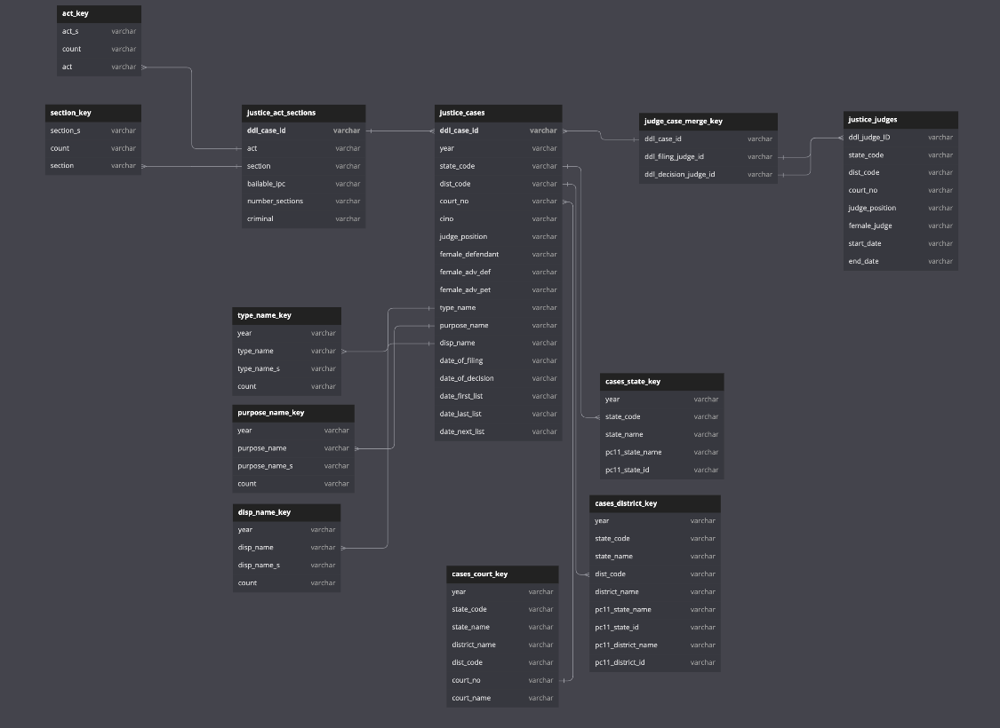

# Judiciary System Analysis

## About:

* This is a data science project that explores ~80 million Indian district court data across states from the Development Data Lab.
* This this project also uses scikit-learn to build a RandomForest classifier to predict wether a judge is likely to award acquisition or conviction

## Approach taken:
* The given information was visualized (see figure below):
* Samples were merged using pandas from each table, and initial data exploration was done to understand correlation between given data.
* From above data exploration, this project looks into 3 major questions:

```
1. The effect of the experience of a judge in awarding dispositions

2. If the gender of the defendant's advocate had any bearing on the outcome (hint: it did)

3. To track the speed of decisions taken by judges vis a vis the number of unfinished cases
```
## Handling Large Data:
* Most of the pandas functions used were used as chunks, which breaks the large files into smaller sections which is much more memory efficient
* Unnecessary columns were dropped to significantly save RAM resources

## Running:

* The code is shared as a .ipynb notebook which can be batch run. The dataset is uploaded as a zip so it needs to be decompressed first, and the decompresed folder should be added to the same directory as the zipped folder

* The 3 analysis points, the classifier, and the data cleaning processes to get clean data fro the classifier are displayed as notebooks, along with the rest of the directory that stores the data, along with a binary of the trained classifier/

## Dependencies:
```
pandas
numpy
matplotlib
scikit-learn
pickle
copy
datetime
```


